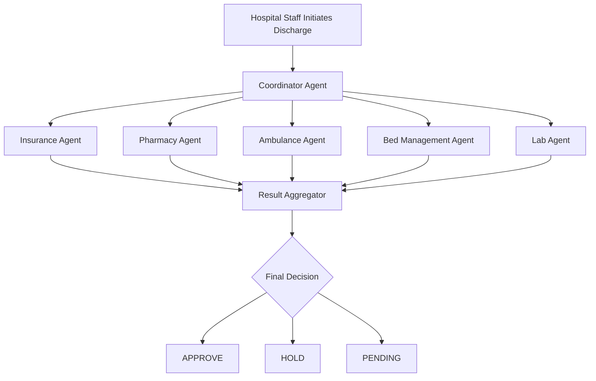

# Patient Discharge Automation System

A multi-agent system using **LangGraph** and **LangChain** with **Google Gemini API** to automate hospital patient discharge verification through 5 specialized agents.

## 🏥 System Overview

When hospital staff initiates discharge for a patient, all 5 agents activate simultaneously to verify different aspects:

- **Insurance Agent** - Verifies coverage, claims, pre-authorizations
- **Pharmacy Agent** - Checks medication reconciliation, pending orders, drug interactions
- **Ambulance Agent** - Assesses transport needs, books if required
- **Bed Management Agent** - Verifies room charges, billing status, deposit refunds
- **Lab Agent** - Confirms test completion, checks critical values

A **Coordinator Agent** orchestrates the workflow, aggregates results, and makes the final discharge decision (APPROVE/HOLD/PENDING).

## 🚀 Quick Start

### 1. Install Dependencies

```bash
pip install -r requirements.txt
```

### 2. Configure Environment

Create a `.env` file:

```bash
cp .env.example .env
```

Edit `.env` and add your Gemini API key:

```
GEMINI_API_KEY=your_actual_api_key_here
```

Get your API key from: https://makersuite.google.com/app/apikey

### 3. Run the System

```bash
python main.py
```

This will run discharge verification for patient `P00231` (default patient in `patient_data.json`).

To verify a different patient:

```bash
python main.py <PATIENT_ID>
```

## 📁 Project Structure

```
dischargeflow_agent/
├── agents/                      # Specialized verification agents
│   ├── base_agent.py           # Base agent class
│   ├── insurance_agent.py      # Insurance verification
│   ├── pharmacy_agent.py       # Pharmacy verification
│   ├── ambulance_agent.py      # Transport assessment
│   ├── bed_management_agent.py # Billing & bed verification
│   └── lab_agent.py            # Lab test verification
├── coordinator/                 # Workflow orchestration
│   ├── coordinator_agent.py    # Decision coordinator
│   ├── workflow.py             # LangGraph workflow
│   ├── workflow_state.py       # State schema
│   └── state_manager.py        # File-based state persistence
├── data/                        # Mock data files
│   ├── lab_results.json
│   ├── pharmacy_inventory.json
│   ├── transport_providers.json
│   ├── billing_snapshot.json
│   ├── housekeeping_schedule.json
│   ├── insurer_records.json
│   └── drug_interaction_rules.json
├── schemas/                     # Pydantic schemas
│   └── agent_schema.py
├── utils/                       # Utility functions
│   └── file_utils.py
├── output/                      # Generated output files
│   ├── discharge_state_<patient_id>.json
│   ├── discharge_audit_log_<patient_id>.json
│   └── final_decision_<patient_id>.json
├── patient_data.json            # Patient information
├── insurance_policy.txt         # Insurance policy terms
├── config.py                    # Configuration management
├── main.py                      # Main entry point
└── requirements.txt             # Python dependencies
```

## 🔄 Workflow



## 📊 Output Files

The system generates three output files per patient:

1. **`discharge_state_<patient_id>.json`** - Complete workflow state
2. **`discharge_audit_log_<patient_id>.json`** - Audit trail
3. **`final_decision_<patient_id>.json`** - Final decision summary

## 🎯 Decision Logic

- **APPROVE**: All agents grant NOC, no blocking issues
- **HOLD**: Critical or high-severity issues found
- **PENDING_AUTO_RESOLUTION**: Only medium/low issues, auto-resolution suggested

## 🧪 Testing with Mock Data

The system includes realistic mock data for testing:

- Patient with liver cancer diagnosis
- Pending lab test (Chest X-Ray)
- Critical lab values (low RBC, high platelets)
- Pending pharmacy order
- Insurance pre-authorization approved
- Billing invoice not yet generated

Modify files in `data/` to test different scenarios.

## 🛠️ Customization

### Adding New Agents

1. Create new agent class in `agents/` inheriting from `BaseAgent`
2. Implement `verify()` method
3. Add agent to workflow in `coordinator/workflow.py`

### Modifying Decision Rules

Edit `_apply_decision_rules()` in `coordinator/coordinator_agent.py`

## 📝 License

MIT License

## 🤝 Contributing

Contributions welcome! Please open an issue or submit a pull request.